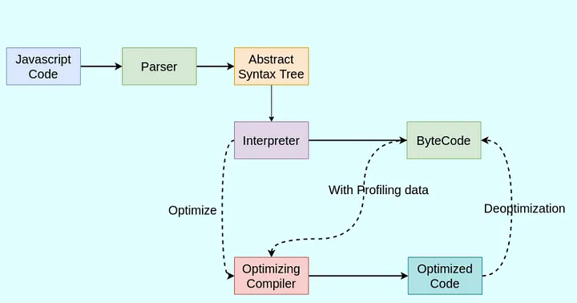

# Level-1: Basic

1. **Is Javascript single-threaded?**

>Yes, JavaScript is a single-threaded language. This means that it has only one call stack and one memory heap. Only one set of instructions is executed at a time.

>Also, Javascript is Synchronous and blocking in nature. Meaning that code is executed line by line and one task must be completed before the next one begins

>However, JavaScript also has asynchronous capabilities, which allow certain operations to be executed independently of the main execution thread. This is commonly achieved through mechanisms like callbacks, promises, async/await, and event listeners. These asynchronous features enable JavaScript to handle tasks such as fetching data, handling user input, and performing I/O operations without blocking the main thread, making it suitable for building responsive and interactive web applications.

2. **Explain the main component of the JavaScript Engine and how it works.**

>Every browser has a Javascript engine that executes the javascript code and converts it into machine code.

 

3. **Explain the event loop in JavaScript and how it helps in asynchronous programming.**

>The event loop is a mechanism that continuously checks the call stack to see if it's empty. If the call stack is empty, it checks the callback queue and pushes any available callbacks onto the call stack for execution. This allows JavaScript to perform non-blocking asynchronous operations despite being single-threaded.

4. **Difference between `var`, `let`, and `const`?**
   - `var`: Function-scoped, can be re-declared, and has hoisting issues.
   - `let`: Block-scoped, cannot be re-declared in the same scope, and prevents hoisting issues.
   - `const`: Block-scoped, cannot be re-assigned or re-declared, and prevents hoisting issues.

5. **Different data types in JavaScript?**
   - Primitive Types: `String`, `Number`, `Boolean`, `Null`, `Undefined`, `Symbol`, `BigInt`
   - Non-Primitive Types: `Object` (includes `Array`, `Function`, `Date`, etc.)

6. **What is a callback function and callback hell?**
   - A **callback function** is a function passed as an argument to another function, to be executed later.
   - **Callback hell** refers to the phenomenon of having multiple nested callbacks, which makes the code difficult to read and maintain.

7. **What is a Promise and Promise chaining?**
   - A **Promise** is an object representing the eventual completion or failure of an asynchronous operation.
   - **Promise chaining** is the practice of attaching multiple `.then()` handlers to handle successive asynchronous operations.

8. **What is async/await?**
   - `async`/`await` is syntax for handling Promises more easily. An `async` function returns a Promise, and `await` pauses the function execution until the Promise is resolved or rejected.

9. **What is the difference between `==` and `===` operators?**
   - `==` (loose equality): Compares values after type conversion.
   - `===` (strict equality): Compares values without type conversion.

10. **Different ways to create an Object in JavaScript?**
    - Using object literals: `let obj = {};`
    - Using the `Object` constructor: `let obj = new Object();`
    - Using `Object.create()`: `let obj = Object.create(proto);`
    - Using class syntax: `class MyClass {}`

11. **What is rest and spread operator?**
    - **Rest operator (`...`)**: Collects multiple elements into an array.
      ```javascript
      function foo(...args) {
        console.log(args);
      }
      ```
    - **Spread operator (`...`)**: Spreads elements of an array or object.
      ```javascript
      let arr = [1, 2, 3];
      let newArr = [...arr];
      ```

12. **What is a higher-order function?**
    - A higher-order function is a function that can take other functions as arguments or return a function as a result.